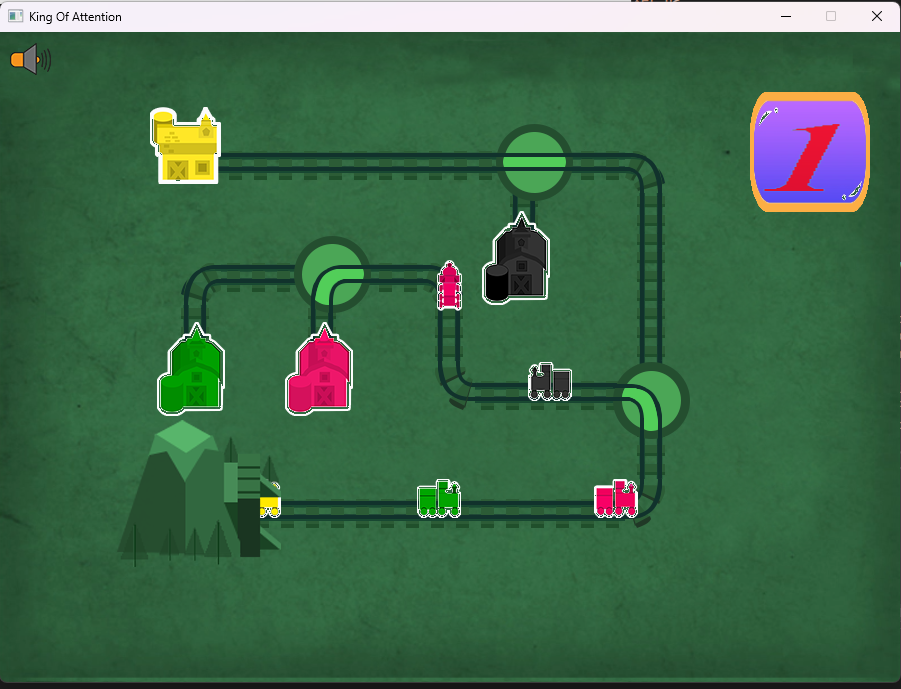
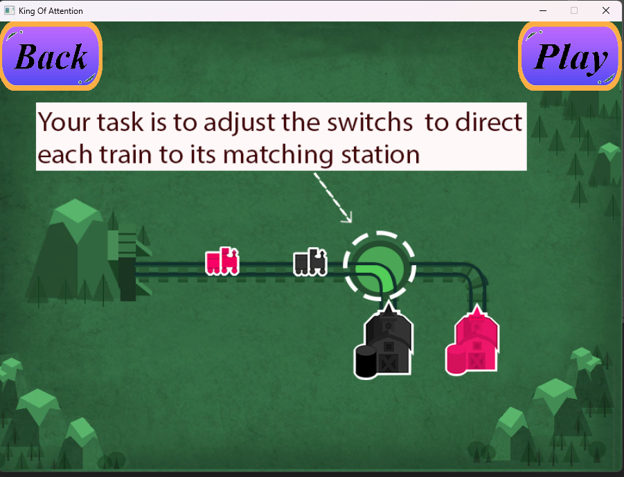
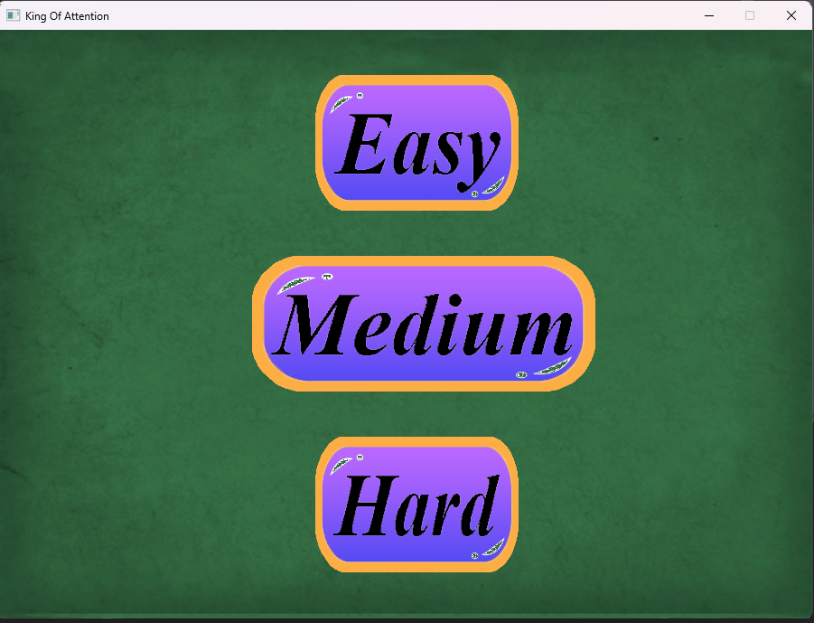
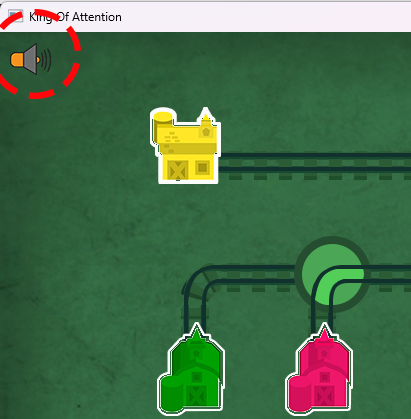
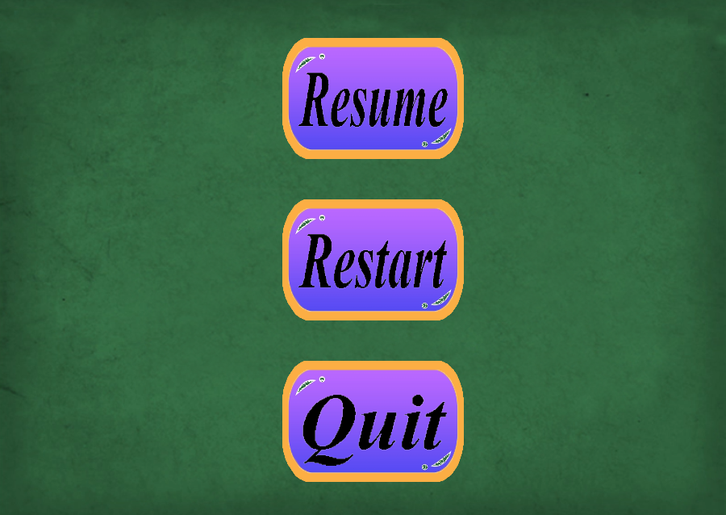

# How to become king of attention? This game will help you much !!!

## Tổng quan về game
- Ý tưởng: Train Of Thought - nhà phát hành Lumosity.
- Mục đích: cải thiện khả năng tập trung của não bộ.
- IDE : Microsoft Visual Studio 2022
- Ngôn ngứ : C++
- Thư viện hỗ trợ: SDL2
- Phần mềm hỗ trợ: Photoshop
## Cách chạy game (trên Window) : 
- Fork this repo
- Cài đặt thư viện 'SDl2', 'SDL2_image', 'SDl2_ttf' và 'SDL2_mixer' dành cho Visual C++
- Tạo 1 empty project, setup thư viện SDL2 cho project.
## Chi tiết về game
### Trải nghiệm game
- Thay đổi các hướng của nút giao (switch) bằng cách click chuột trái, sao cho tàu đi vào ga có cùng màu.

- Có 3 level tương ứng với độ khó lần lượt là : dễ - trung bình - khó.

- Để chiến thắng, bạn chỉ được phép để tối đa 4 tàu đi nhầm ga.
- Góc trên bên phải màn hình hiện số tàu đã đi đúng.
- Game có thêm âm thanh của tiếng tàu di chuyển để thêm thử thách cho người chơi, bạn có thể tắt nó bằng cách click vào biểu tượng loa.

- Bạn có thể dừng lại trong khi chơi bằng cách bấm phím ESC, muốn tiếp tục hãy nhấn Resume trên màn hình.
- 
## Hoàn thiện trong tương lai
- Thêm màn chơi
- Nâng cấp đồ họa
- Đăng nhập tài khoản, lưu kết quả mỗi người chơi.
